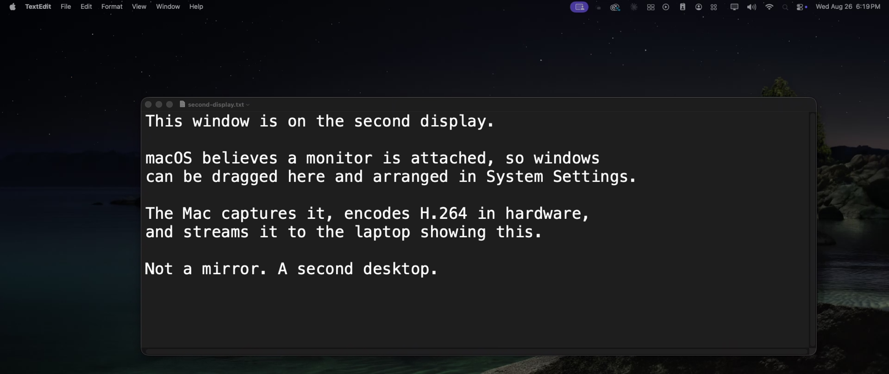
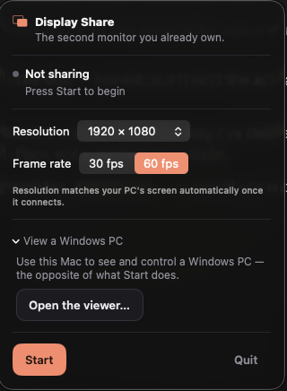

<div align="center">

# Display Share

**Turn a Windows laptop into a real second display for your Mac.**

[](https://github.com/nbkdoesntknowcoding/display-share/actions/workflows/build.yml)
[](https://github.com/nbkdoesntknowcoding/display-share/releases/latest)
[](LICENSE)
[](#requirements)
[](#requirements)

</div>

A laptop's HDMI port is output-only, so no cable can do this. Display Share
creates a **real virtual display** on the Mac — macOS believes a monitor is
attached, so you can drag windows onto it, set its resolution, and arrange it in
System Settings. It captures that display, encodes it in hardware, and streams it
to a receiver app on the laptop.

Not a mirror. Not a remote desktop. A second desktop.



<div align="center"><sub>What the receiver shows: a real macOS desktop, captured and streamed as H.264.<br>
The menu bar is the giveaway — macOS is drawing a whole second screen, not copying the first.</sub></div>

```
   Mac                                          Windows laptop
 ┌───────────────────────┐                     ┌──────────────────────┐
 │ CGVirtualDisplay      │                     │  Tauri receiver      │
 │   ↓ ScreenCaptureKit  │   H.264 over        │   ↓ WebCodecs        │
 │   ↓ VideoToolbox      │ ──WebSocket (LAN)──▶│   ↓ canvas           │
 │   ↑ CGEvent injection │ ◀──input events──── │   ↑ mouse + keyboard │
 └───────────────────────┘                     └──────────────────────┘
```

```bash
git clone https://github.com/nbkdoesntknowcoding/display-share.git
cd display-share && ./install.sh
```

Then grant Screen Recording when asked, click **Start** in the menu bar, and run
the receiver on the laptop. It finds the Mac on its own.

---

## Contents

- [How it compares](#how-it-compares)
- [Two apps, and which one you need](#two-apps-and-which-one-you-need)
- [Installing](#installing)
- [Using it](#using-it)
- [Using a cable instead of Wi-Fi](#using-a-cable-instead-of-wi-fi)
- [Requirements](#requirements)
- [Known limits](#known-limits)
- [What we measured](#what-we-measured)
- [Troubleshooting](#troubleshooting)
- [How it works](#how-it-works)
- [Contributing](#contributing)
- [What isn't proven yet](#what-isnt-proven-yet)
- [Licence and credits](#licence-and-credits)

---

## How it compares

There are several ways to get a second screen, and they are not the same thing.
What matters most is whether the OS believes a display exists — that is the
difference between dragging a window onto it and watching a copy of a screen you
already have.

| | Extends the desktop | Runs on | Open source | Needs |
|---|---|---|---|---|
| **Display Share** | **Yes** — a real display | Mac → Windows / any browser | **Yes**, GPL-3.0 | Nothing but the two machines |
| Apple Sidecar | Yes | Mac → iPad | No | An iPad |
| Duet Display | Yes | Mac → iPad, Android, PC | No | Paid subscription |
| Luna Display | Yes | Mac → iPad, Mac | No | A hardware dongle |
| Deskreen | No — mirrors only | Any → browser | Yes, AGPL-3.0 | — |
| spacedesk | Yes | **Windows** → other devices | No | A display driver, Windows as the source |

The direction matters as much as the feature. Most of this category points *away*
from a Mac and towards a tablet, or points away from Windows. Display Share
points a Mac at the Windows laptop you already own, which is the one combination
that tends to be sitting unused on the same desk.

**Where the others are the better choice:** Sidecar is free, first-party, and
supports Apple Pencil — if you have an iPad, use it. spacedesk is the right tool
when Windows is the machine with the screens to give away. Deskreen is excellent
at what it does, which is showing one screen on many devices.

---

## Two apps, and which one you need

Display Share is a pair. Opening the wrong half is the most likely way to get
confused, so:

| | Runs on | What it looks like | You want it if |
|---|---|---|---|
| **DisplayShare** (sender) | the **Mac** | a **menu bar icon** — no Dock icon, no window | you want an extra screen |
| **Display Share Receiver** | the **laptop** | a fullscreen window | it is the screen being borrowed |

<div align="center">

<br><sub>The sender, in full. It has no window — this panel is the whole interface.</sub>
</div>

The sender showing "no window" is not a failure — it is a menu bar app. Look at
the top-right of the screen for a display icon.

If you see **"Enter the Mac's address and press Connect"**, you have opened the
*receiver* on the Mac. That is the wrong half; close it and open the sender.

---

## Installing

### The one-command way (recommended)

```bash
git clone https://github.com/nbkdoesntknowcoding/display-share.git
cd display-share && ./install.sh
```

That checks your macOS version and tools, installs `xcodegen` if missing, builds,
installs to `/Applications`, and opens the right Settings pane. `./install.sh
--uninstall` reverses it.

**Building is the *easy* path here, not the hard one.** A locally built app has no
quarantine attribute, so macOS launches it normally — no "Apple cannot check it
for malicious software", no trip through Privacy & Security to click *Open
Anyway*. Downloading the `.dmg` is the route that triggers that warning, because
Display Share is open source and does not buy code signing certificates.

### Or download a build

[Latest release](https://github.com/nbkdoesntknowcoding/display-share/releases/latest)
— universal `.dmg` for the Mac, NSIS `.exe` for Windows, with `SHA256SUMS`.

These are **unsigned**, so both systems warn on first launch:

* **macOS** — open it once, then System Settings → Privacy & Security → **Open Anyway**
* **Windows** — **More info** → **Run anyway**

[docs/distribution.md](docs/distribution.md) explains why, and what each warning
actually means.

### Manual build

```bash
# Mac sender
brew install xcodegen
cd mac && xcodegen generate
xcodebuild -scheme DisplayShare -configuration Release -derivedDataPath ./.build build

# Windows receiver (needs Rust + Node 22)
cd windows && npm ci && npx tauri build
```

<details>
<summary><b>Or hand it to a coding agent</b> — a prompt that knows where the human steps are</summary>

Paste this into Claude Code, Cursor, or any agent with shell access. The
important part is that it stops before the permission grant, because no script
can grant macOS permissions:

````text
Set up Display Share on this machine. It turns a Windows laptop into a real
second display for a Mac. Repo: https://github.com/nbkdoesntknowcoding/display-share

MAC SENDER (only runs on macOS 14+):
1. git clone https://github.com/nbkdoesntknowcoding/display-share.git && cd display-share
2. Run ./install.sh and show me its output. It installs xcodegen if needed,
   builds a Release build, and installs to /Applications.
3. If it fails, read the build log path it prints and fix or report the error.
   Do NOT skip failures or fall back to a Debug build.

THEN STOP AND ASK ME. You cannot do the next part:
macOS permissions are granted by a human in System Settings — no command,
script, or API can grant them, and a freshly built copy counts as a NEW app
identity even if I granted them before. Tell me to:
  - System Settings > Privacy & Security > Screen Recording > enable Display Share
  - (only if I want to control the Mac from the laptop)
    Privacy & Security > Accessibility > enable Display Share
Then wait for me to confirm.

VERIFY (after I confirm):
4. Launch /Applications/DisplayShare.app. It is a MENU BAR app — no Dock icon,
   no window. Click its icon and press Start.
5. Confirm a virtual display exists: `system_profiler SPDisplaysDataType | grep -i display`
   should show one more display than the physical monitors.
6. Open http://localhost:8787 in a browser on the Mac. Expect a black canvas and
   a HUD. It stays black until something is actually on that display — drag a
   window onto the new display, then the HUD should show ~58 fps.
   A near-black screen with capture near 0 fps is CORRECT for an empty desktop
   — that is not a bug.

WINDOWS RECEIVER (run this part on the Windows laptop):
7. Install Rust (https://rustup.rs) and Node 22+.
8. cd windows && npm ci && npx tauri build
9. Run the installer from windows/src-tauri/target/release/bundle/nsis/
   SmartScreen will warn because it is unsigned: More info > Run anyway.
10. The app finds the Mac over Bonjour. Enter the 4-digit PIN the Mac shows.
    Both machines must be on the same network, on 5 GHz Wi-Fi or Ethernet.

USEFUL TO KNOW:
- Ports 8787 (viewer page) and 8788 (video + control) must not be blocked.
- Keys in the receiver: F fullscreen, H toggle HUD, K force a keyframe,
  A cycle decode mode, F8 forward input to the Mac.
- Read README.md "Known limits" before reporting a bug — the 60 Hz cap, the
  ~1920x1200 geometry ceiling and no-HDCP are properties of Apple's private
  API, not defects.
- If anything is ambiguous, read docs/distribution.md and protocol/SPEC.md
  rather than guessing.
````

</details>

---

## Using it

### Connecting, once

**On the Mac**

1. Launch **Display Share**. It lives in the menu bar — no Dock icon and no
   window, so look at the top-right of the screen for a display icon
   ([this is the whole interface](#two-apps-and-which-one-you-need)). First run
   explains the one permission it needs and detects the grant without a restart.
2. Click **Start**. A second display appears immediately: open System Settings →
   Displays and it is there, arrangeable like any monitor.

**On the laptop**

3. Launch the receiver. It finds the Mac over Bonjour, so there is no address to
   type — pick it from the list. If your network blocks mDNS (guest and
   AP-isolated Wi-Fi usually do), type the Mac's IP instead.
4. Enter the 4-digit PIN the Mac is showing. Once per device, then that laptop
   goes straight through every time.

Press **F** for fullscreen, then drag windows onto the new display from the Mac.
Nothing else needs configuring — resolution follows the laptop's own panel as
soon as it connects.

> If the receiver says **"busy — another receiver is already connected"**, one is
> already attached. Only one at a time, by design.

### Keys in the receiver

| Key | Does |
|---|---|
| `F` | Fullscreen |
| `H` | Show or hide the HUD |
| `K` | Force a fresh keyframe |
| `A` | Cycle hardware / software decode |
| `F8` | Forward this laptop's mouse and keyboard to the Mac |

While input forwarding is on, every other key belongs to the Mac — only `F8`
stays local, so there is always a way back.

### Two directions of control, and they are not the same thing

* **Your Mac's own mouse and keyboard already work on the second screen** — it is
  a real display, so the cursor walks onto it exactly like a physical monitor.
  Nothing to enable.
* **To drive the Mac from the laptop**, press **F8** on the receiver. A badge
  shows while it is live. This needs **Accessibility** permission on the Mac —
  without it macOS silently discards injected events, so the app reports
  `input_unavailable` rather than pretending to work.
* **Push the cursor past the edge** of the second screen and it keeps going onto
  the rest of the Mac's desktop. The receiver takes a pointer lock and switches
  to relative motion there, because the OS clamps the real pointer at the screen
  edge and an absolute position simply pins at the boundary. Move back and
  control returns automatically. `F8` or `Esc` hands the pointer back at any
  time.

### When Netflix or Prime Video refuses to play

Protected video checks **every display attached to your Mac**, not just the one
it is playing on. A virtual display cannot carry the copy protection those
services require, so they refuse to play *anywhere* while it exists — including
on the Mac's own built-in screen. Apple's Sidecar behaves the same way, for the
same reason.

There is no fix, only a choice, so the app makes it an explicit one: the popover
has a **Release the screen** control that takes the display out of the topology.
Protected video plays again immediately, your windows move back to the Mac, and
your laptop stays paired so bringing it back is one click.

### Viewing Windows from the Mac

The reverse direction is a **remote desktop**, not a second display. One install
on each machine does both; you pick a direction rather than reinstalling.

1. **Windows** — open Display Share Receiver and click **Share this PC's screen
   instead**. It shows the machine name and port.
2. **Mac** — menu bar icon → **View a Windows PC…**. It finds the PC on its own;
   if mDNS is blocked, type the address and port `7879`.

**Only one direction runs at a time.** Both apps refuse the second rather than
trusting you not to try it: two machines each capturing and encoding the other
feeds each screen back into the other, saturating the link — and the adaptive
bitrate controller would then be reacting to congestion it was itself creating.

Click **Control this PC** in the viewer to drive Windows from the Mac. Windows
needs no permission for this, but it does refuse to inject into **windows running
as administrator** — Task Manager, an elevated PowerShell, and the UAC prompt
itself will ignore the Mac's keyboard while everything else works. That is a
Windows security boundary, not a fault here. Run the receiver as administrator if
you need it.

Keys are sent by physical position rather than by the character they produce, so
a UK Mac driving a US Windows machine types what you actually pressed.

### Turning the mirror into a real extra desktop

By default the reverse direction duplicates the Windows screen. Windows cannot be
given a *virtual* display without a signed Indirect Display Driver, which this
project deliberately does not ship.

A **dummy display adapter** — an HDMI or DisplayPort plug that reports a monitor,
roughly the price of a coffee — sidesteps it entirely. Windows genuinely extends
onto it, and the display picker next to the share button lets you share *that*
output. No driver, no certificate.

> Unverified: the code path is exercised, the hardware is not.

---

## Using a cable instead of Wi-Fi

Wi-Fi is usually the largest source of lag, and not because of bandwidth — a
1080p stream needs roughly 10–15 Mbps, which any modern link manages. It is
**jitter**: frames arrive in clumps, and a clump is felt as a stutter even when
the average frame rate looks perfect. A cable removes it, and costs nothing in
sharpness or frame rate.

The apps need no configuration for this. Both ends advertise and browse on every
interface, so plugging in a cable is the entire procedure. **The HUD names the
link it is actually using** — `Ethernet`, `Wi-Fi`, and `direct` when the two
machines are wired straight to each other.

| Setup | Works | Notes |
|---|---|---|
| Ethernet, both into the router | Yes | Simplest. Removes Wi-Fi from both ends |
| Ethernet, machine to machine | Yes | Lowest latency. Modern ports auto-negotiate, so no crossover cable |
| Thunderbolt / USB4, machine to machine | Yes, if **both** ends support it | macOS calls this Thunderbolt Bridge. Very fast |
| A plain USB-C cable | **No** | USB-C is a connector, not a network. Without Thunderbolt on both ends it carries no IP at all |

> **Check before buying anything.** On Windows, look for a *Thunderbolt*
> controller in Device Manager. Many laptops have USB-C ports that do power and
> DisplayPort but not Thunderbolt, and those cannot bridge. Two USB-C-to-Ethernet
> adapters and a cable achieve the same result for very little.

With no router in between, neither machine gets an address from DHCP, so both
self-assign one in `169.254.x.x`. That is normal and needs no setup. The Mac
keeps its Wi-Fi connection at the same time, so the internet carries on working.

---

## Requirements

| | |
|---|---|
| Mac | macOS 14 or later, Apple Silicon or Intel |
| Receiver | Windows 10/11. Any device with a modern browser also works for testing |
| Network | **5 GHz Wi-Fi or Ethernet.** 2.4 GHz jitter is visible as stutter |
| Permissions | Screen Recording (required), Accessibility (only for remote control) |
| Ports | 8787 viewer page, 8788 video and control, 7879 for the reverse direction |

---

## Known limits

These come from the private `CGVirtualDisplay` API and are **not** going away:

| Limit | Detail |
|---|---|
| **60 Hz ceiling** | Every mode the virtual display advertises is 60 Hz. Requesting 120 yields ~64 fps because the surface does not update faster |
| **~1920×1200 maximum** | Larger geometries are adopted *wrongly* and silently: 2560×1080 becomes 1280×540, 2560×1440 falls back to 1920×1080. Display Share fits your panel's **aspect ratio** inside the reliable envelope instead — a 2560×1080 panel gets 1920×810, which fills it exactly with no letterboxing |
| **SDR only** | No HDR |
| **No HDCP** | Protected video will not play *on any display* while the virtual one exists. See [above](#when-netflix-or-prime-video-refuses-to-play) |
| **Not on the Mac App Store** | `CGVirtualDisplay` is a private API; App Review rejects private API use outright |
| **Private API risk** | A future macOS release could remove or change `CGVirtualDisplay`. Verified working on macOS 26.2 (25C56) |

---

## What we measured

Findings from building this, kept here because they cost real time to discover
and are useful to anyone working in the same area.

**Chrome's hardware H.264 decoder carries a ~69 ms pipeline — 22× worse than
software decoding the identical stream (~3 ms).** Hardware decode is optimised
for throughput on long video, not for latency on a live one. The receiver
defaults to software decode because of it. Press `A` to cycle and measure it on
your own hardware.

**`CGVirtualDisplay` accepts geometries it then silently gets wrong.** Requests
above roughly 1920×1200 are sometimes halved and sometimes replaced with
1920×1080, and the API reports success either way. The only way to know what you
got is to read it back.

**Protected playback evaluates the entire output topology, not the display in
use.** One output that cannot carry HDCP refuses playback on all of them. This is
why Sidecar has the same behaviour, and why filtering what you capture cannot
help — the trigger is the display existing.

**`kVTVideoEncoderSpecification_EnableLowLatencyRateControl` is an encoder
*specification*, not a property.** It has to be passed to
`VTCompressionSessionCreate`; setting it afterwards with `VTSessionSetProperty`
does nothing, silently. Every other knob on that encoder is a property, which is
what makes it easy to miss. Read the encoder identifier back to confirm you got
`…h264.rtvc` rather than `…ave.avc`.

**Network.framework's `.idempotent` send completion installs no handler at all.**
It means "safe to resend", not "tell me when it is done" — so an encoder using it
has no back-pressure signal and will run ahead of the socket without limit.
`.contentProcessed` is the documented mechanism.

**An idle desktop sends nothing, and that breaks things that assume otherwise.**
ScreenCaptureKit marks frames as carrying no new pixels rather than resending an
unchanged surface. Anything measuring health by encoded frames — a bitrate
controller, a watchdog — will read a still desktop as a failing link. Both
mistakes were shipped here before they were caught.

### Performance

Measured on a Mac mini M4, macOS 26.2, at 1080p60 over **localhost** — so these
exclude LAN transit and are a floor, not a promise:

| | Value |
|---|---|
| Capture | 57.8 fps against a 60 fps target |
| H.264 encode | 5.62 ms/frame |
| Bandwidth | ~1.4 Mbps synthetic content |
| Capture cost | ~1.4% of one core |
| Decode (software) | ~3 ms |

**On end-to-end latency, deliberately no headline number.** The receiver's HUD
reports each stage separately — network hand-off, decode, paint, and the wait for
the compositor — and the honest position is that nobody has yet recorded those on
real hardware over a real LAN. If you run it, the numbers are on screen under
`H`, and a report of them is a genuinely useful contribution.

---

## Troubleshooting

| Symptom | Cause | Fix |
|---|---|---|
| "Cannot be opened because Apple cannot check it" | Unsigned build | System Settings → Privacy & Security → **Open Anyway**. See [docs/distribution.md](docs/distribution.md) |
| "Windows protected your PC" | Unsigned installer | **More info** → **Run anyway** |
| Menu bar says *Screen Recording permission has not been granted* | macOS TCC | Grant it, then reopen the menu. A freshly built copy is a new identity and needs granting again |
| **Settings shows Display Share enabled, but the app still asks** | The listed entry belongs to an **older build**. macOS lists apps by name, so a stale entry is indistinguishable from a live one | `install.sh` signs with a stable local identity, so this should not recur. On an older copy: `tccutil reset ScreenCapture in.theboringpeople.displayshare`, then grant again |
| App says *Not granted* even though you just granted it | `CGPreflightScreenCaptureAccess()` caches its answer for the life of the process | The app detects this via a short-lived child process and shows **"Granted — restart"**. Quit and reopen |
| Receiver shows black, HUD says `capture 0.0 fps` | Nothing is on the virtual display | Drag a window onto it. An idle desktop legitimately sends no frames |
| Receiver cannot find the Mac | mDNS blocked, or different subnets | Type the Mac's IP manually. Guest and AP-isolated Wi-Fi block Bonjour |
| `busy — another receiver is already connected` | One receiver at a time, by design | Close the other, or wait ~10 s for the socket to drop |
| Stutter, image goes soft under load | Adaptive bitrate reducing quality | Working as designed: sharpness degrades rather than latency accumulating. Move to 5 GHz or Ethernet |
| Netflix or Prime Video will not play, even on the Mac's own screen | Protected video refuses while any non-HDCP display exists | Use **Release the screen** in the popover. [Why](#when-netflix-or-prime-video-refuses-to-play) |
| Mouse and keyboard do nothing after `F8` | **Accessibility** not granted — a SEPARATE permission from Screen Recording, so video can work perfectly while input is blocked | Enable it under Privacy & Security → Accessibility. To see what the app sees: `open -a /Applications/DisplayShare.app --args --check-permissions --out /tmp/p.txt && sleep 3 && cat /tmp/p.txt` |
| Windows scattered after a crash | The display was destroyed | Relaunch within ~8 s and the helper re-attaches the *same* display, preserving arrangement |
| Second display gone after Mac sleep | Capture died on wake | Recovers automatically, typically under 0.1 s. If not, toggle Stop then Start |
| Launched the sender and nothing happened | It is a menu bar app — `LSUIElement`, so no Dock icon and no window by design | Look at the top-right menu bar for a display icon |

---

## How it works

```
install.sh            one-command build + install for the Mac sender
mac/
  DisplayShare/       SwiftUI MenuBarExtra app + onboarding
  DisplayShareCore/   capture, encode, transport, pairing, input
  vd_helper/          subprocess that owns the CGVirtualDisplay
  Shared/             wire protocol + helper IPC, compiled into both
  dsprobe/            dev harness for capture/encode measurements
  scripts/            acceptance tests + packaging
windows/
  src/                TypeScript frontend: WebCodecs decode + canvas + input
  src-tauri/          Rust backend: owns the WebSocket
protocol/             SPEC.md + golden test vectors
docs/                 findings, distribution
```

`vd_helper` is a separate process on purpose: a virtual display dies with the
process holding it, so isolating it means a crash in the capture or encode
pipeline does not destroy your window arrangement.

The wire protocol is specified in [`protocol/SPEC.md`](protocol/SPEC.md), and the
Swift and TypeScript parsers are tested independently against the same golden
vectors — so a shared misunderstanding cannot pass.

---

## Contributing

Pull requests are welcome. [CONTRIBUTING.md](CONTRIBUTING.md) covers the
licensing rules that matter here, and the fact that the Xcode project is
**generated** from [`mac/project.yml`](mac/project.yml) — edit the YAML, not the
`.xcodeproj`.

```bash
brew install xcodegen
cd mac && xcodegen generate

# 201 Swift tests
xcodebuild -scheme DisplayShareCore -derivedDataPath ./.build test

./scripts/test-helper-lifecycle.sh      # vd_helper lifecycle
python3 scripts/ws-acceptance.py        # wire protocol over WebSocket
python3 scripts/pairing-acceptance.py   # discovery + PIN pairing
python3 scripts/robustness-soak.py      # drops, reconfiguration, recovery
python3 scripts/abr-acceptance.py       # adaptive bitrate
python3 scripts/input-acceptance.py     # input forwarding + auth gate
python3 scripts/injection-acceptance.py # CGEvent injection vs the real cursor

cd ../windows && npm ci
cargo test --manifest-path src-tauri/Cargo.toml          # 53 Rust tests
node scripts/verify-vectors.mjs                          # TS parser vs golden vectors
node --experimental-strip-types scripts/verify-timing.mjs
node --experimental-strip-types scripts/verify-window-states.mjs
npx tauri dev
```

**The most useful contributions right now** are measurements rather than code —
see [What isn't proven yet](#what-isnt-proven-yet). A HUD screenshot from a real
Mac-to-Windows session over a real LAN would settle several open questions at
once.

Found a security issue? Please open a private advisory through GitHub's
**Security** tab rather than a public issue.

---

## What isn't proven yet

Stated plainly, because everything above was measured and these were not:

* **End-to-end latency on real hardware is unmeasured.** Every figure here is
  localhost. The per-stage instrumentation exists and reports on the HUD; nobody
  has run it on a real LAN.
* **Cursor roaming past the screen edge is unverified.** The clamping is covered
  by tests, but the pointer-lock handoff has been reasoned about, not used.
* **No real sleep/wake cycle.** The recovery path was exercised through the same
  entry point the wake notification calls, not by actually sleeping the Mac.
* **2.4 GHz congestion** was simulated through the control channel, not real RF.
* **The dummy-adapter path** for extending Windows has not been tried with real
  hardware.

---

## Privacy

Display Share captures **only the virtual display it creates**, never your real
screen. macOS makes no such distinction, so the purple recording indicator
appears exactly as it does for Zoom or OBS.

Video never leaves your LAN — no server, no account, no telemetry. A receiver
must pair with a 4-digit PIN before it gets any video, and input forwarding is
refused entirely until it does.

Both apps check GitHub Releases at launch and **neither updates silently** — the
Mac app links you to the release page, and the Windows app downloads only after
you click *Update and restart*. For an unsigned app, a self-replacing binary is
the wrong default.

---

## Licence and credits

GPL-3.0. See [LICENSE](LICENSE).

Built with reference to [DeskPad](https://github.com/Stengo/DeskPad) (MIT) for
the virtual-display approach. The private CoreGraphics interface in
`mac/CGVirtualDisplayPrivate` was derived by Objective-C runtime introspection on
the target machine, not copied from any project. GPL-3.0 projects in this space
(opendisplay, Lumen, Sunshine, moonlight-qt) were read for architecture only.
